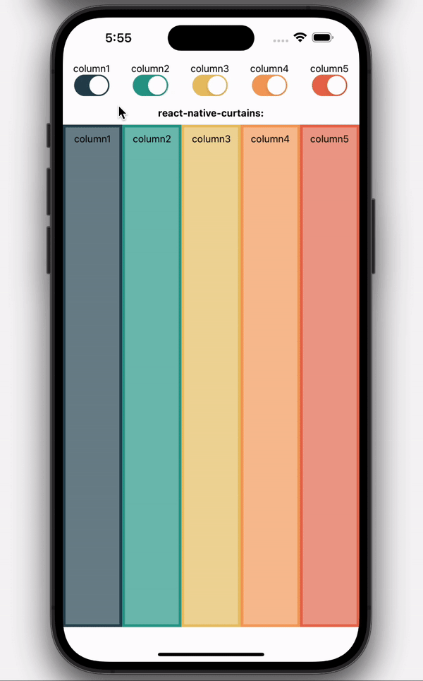
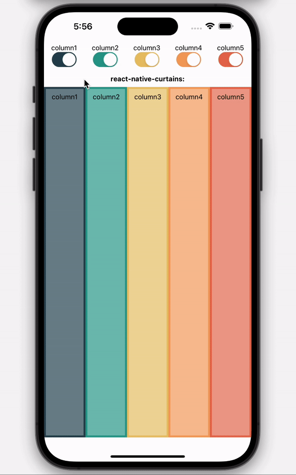

# react-native-curtains

[](https://www.npmjs.com/package/react-native-curtains)

Lightweight helper lib for mounting + unmounting of child elements in an animated 'curtain' style.

## Demo

### With 'bounce' animation:



### With 'linear' animation:



## Live Demo
Try it out via [this expo snack](https://snack.expo.dev/@maks-io/react-native-curtains-demo?platform=web).

## Highlights

- lightweight
- no actual dependency
- you decide if you want to use <a href="https://www.npmjs.com/package/@react-spring/native">@react-spring/native</a> or <a href="https://www.npmjs.com/package/react-native-reanimated">react-native-reanimated</a> for the animations

## Installation

This library works with both, <a href="https://www.npmjs.com/package/@react-spring/native">@react-spring/native</a> and <a href="https://www.npmjs.com/package/react-native-reanimated">react-native-reanimated</a>. You need to install one of them and set the `lib` prop accordingly (details below).

Installing `react-native-curtains` itself:

If you use expo, use:

```bash
expo install react-native-curtains
```

Otherwise, for npm use:

```bash
npm i react-native-curtains --save
```

And for yarn use:

```bash
yarn add react-native-curtains
```

## Usage

Use `import { ReactNativeCurtains } from "react-native-curtains"` to access the main component.

The following example shows a three column usage, where the column with the key `"column2"` gets removed and therefore unmounted including animation.

<table>
<tr>
<td> before </td> <td> after </td>
</tr>
<tr>
<td>

```tsx
<ReactNativeCurtains lib={"reanimated"}>
  <View key={"column1"}>
    <Text>column1</Text>
  </View>
  <View key={"column2"}>
    <Text>column2</Text>
  </View>
  <View key={"column3"}>
    <Text>column3</Text>
  </View>
</ReactNativeCurtains>
```

</td>
<td>

```tsx
<ReactNativeCurtains lib={"reanimated"}>
  <View key={"column1"}>
    <Text>column1</Text>
  </View>
  <View key={"column3"}>
    <Text>column3</Text>
  </View>
</ReactNativeCurtains>
```

</td>
</tr></table>

Note the keys on the immediate children of `<ReactNativeCurtains />` - only if those are available, the library can appropriately animate the mounting and unmounting of any given child.

Mounting additional children of course also works the same way.

This example would use `react-native-reanimated` as the underlying animation library, due to how the `lib` prop is set to `"reanimated"` - for details see section "props" below.

## Props

| prop              | required | default    | type                                                                                                                          | description                                                                                                                                                                                                                                                                                  |
| ----------------- | -------- | ---------- | ----------------------------------------------------------------------------------------------------------------------------- |----------------------------------------------------------------------------------------------------------------------------------------------------------------------------------------------------------------------------------------------------------------------------------------------|
| lib               | yes      |            | `"reanimated"` &#124; `"spring"`                                                                                              | Mandatory prop to define the animation library used in the background (`"reanimated"` for <a href="https://www.npmjs.com/package/react-native-reanimated">react-native-reanimated</a>, `"spring"` for <a href="https://www.npmjs.com/package/@react-spring/native">@react-spring/native</a>) |
| AnimationModule   | yes      |            | The entire Animation Module                                                                                                   | Import the desired module via `import * as AnimationModule from "react-native-reanimated"` or `import * as AnimationModule from "@react-spring/native"` and then pass it as the prop's value, like `AnimationModule={AnimationModule}`.                                                      |
| children          | yes      |            | `JSX.Element[]`                                                                                                               | The children that will be animated upon mounting/unmounting. Make sure to use unique `key`s so that the library can properly do its job.                                                                                                                                                     |
| animationDuration | no       | `500`      | `number`                                                                                                                      | The animation duration in milliseconds.                                                                                                                                                                                                                                                      |
| easing            | no       | `"linear"` | `"linear"` &#124; `"ease"` &#124; `"quad"` &#124; `"cubic"` &#124; `"sin"` &#124; `"circle"` &#124; `"exp"` &#124; `"bounce"` | Animation style, based on functions defined at https://reactnative.dev/docs/easing. However, this prop is only allowed when `lib` is set to `"reanimated"`. When using `"spring"` the animations will always be linear.                                                                      |

## Choosing the animation library

There are Pros and Cons for either library, I will quickly try to summarize what my thoughts are:
In general one might want to re-use a library if it is already part of a app. If you have already setup `react-native-reanimated`, there is no need to add an additional dependency, and vice versa.
At least, almost... `react-native-reanimated` behaves more smoothly, especially when using slower animation durations and quickly mounting/unmounting multiple children within a short time frame. With the `@react-spring/native` this might lead to visual glitches.
So it depends on your use case. Also it does only allow to animate in a "linear" way, while reanimated allows multiple easing functions. One upside for spring is the easier way to set it up initially (just install it and you should be good to go, reanimated on the other hand would take some additional setup steps, see their docs for details).
